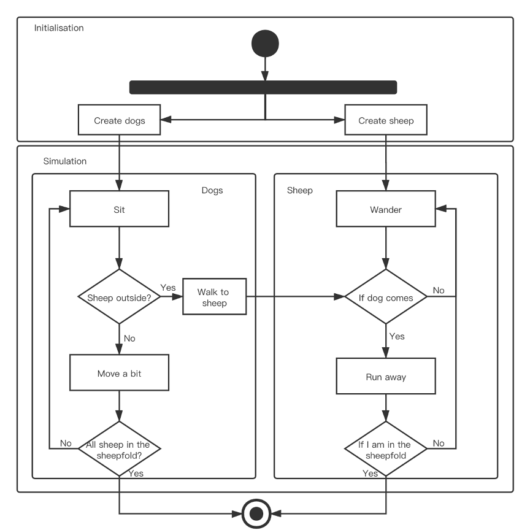
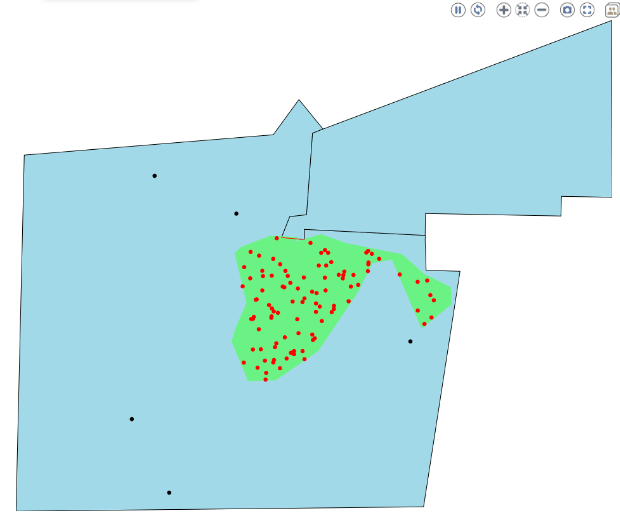
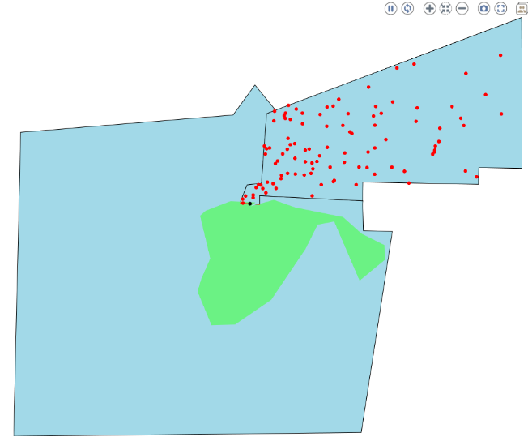
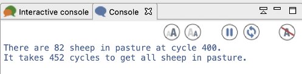
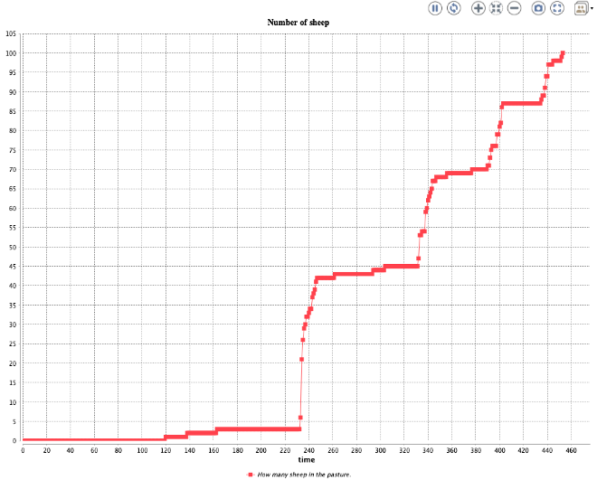
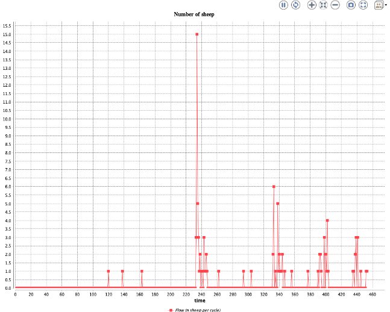
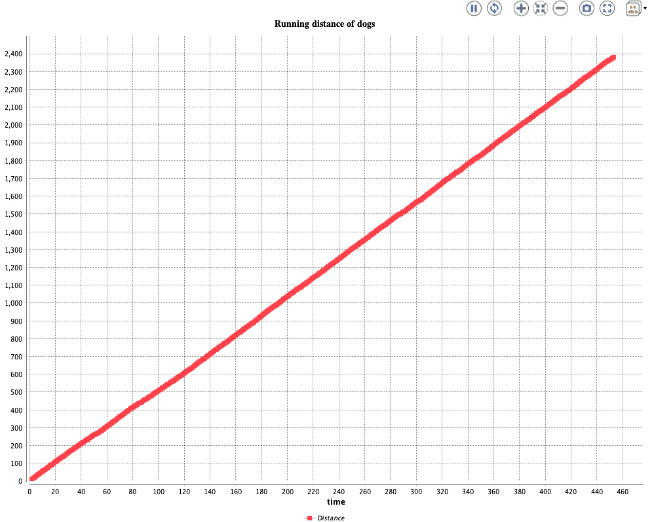
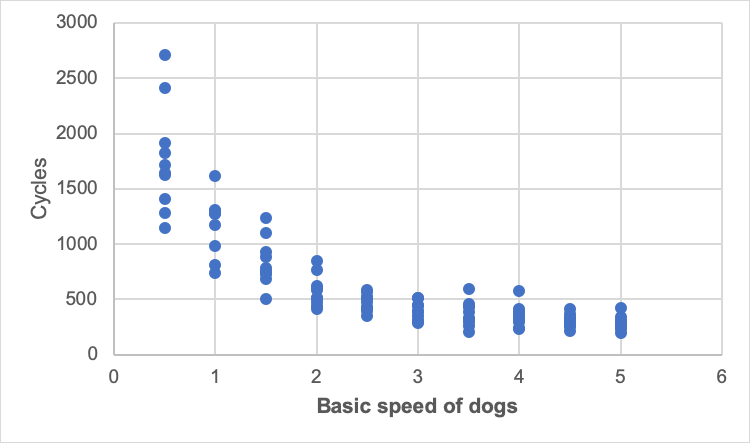
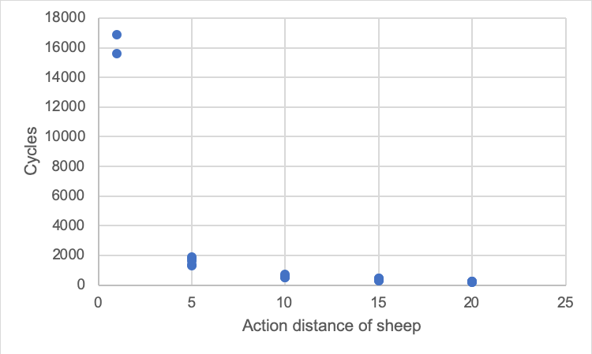

# A simulation of herding dogs with GAMA-Plaform

## Introduction

Herding dog is a type of pastoral dog that either has been trained in herding or belongs to breeds that are developed for herding. Dogs can work other animals under the command of a human. 

In the following case, suppose we have a farm. In the morning, sheep ran out of the sheepfold. Sheep always stay together. They eat grass on the farm arbitrarily in groups. In the evening, herdsman wants his sheep back. He asks his herding dogs to drive the sheep back to the sheepfold. 

The video above shows the sheep and herding dogs. Dogs run to chase those sheep and get them in the pasture. So, we are going to use Gama to simulate the scenario and try to find out what condition may influence the time of the whole process.

## Conceptual design

There are 2 objects mainly in this case, herding dog and sheep. Dogs chase sheep if sheep are not in the pasture. Sheep run to the gate of pasture if a dog is near them. The following chart is the conceptual UML model of this case. 

## Relevant parameters

* Number of dogs
* Speed of dogs
* Door of the sheepfold Action distance of sheep

## Patterns

* Snapshot of the number of sheep in sheepfold

**Output**: the number of sheep in sheepfold at time t 

* Temporal trend of the number of sheep

**Output**: a time series chart of the number of sheep in sheepfold 

* The running distance of each dog

**Output**: running distance [m] 

* Flow of sheep running into sheepfold

**Output**: the number of sheep in a time interval [n sheep per cycle]

## Scenarios

* The faster dogs run, the less time may be used to get all sheep in the sheepfold.
* The more dogs there are, the less time may be used.
* The wider the door is, the less time may be used.

## Model design

I used GAMA simulate the scenario. GAMA is a modeling and simulation development environment for building spatially explicit agent-based simulations. See it in 
[GAMA-Platform](https://github.com/gama-platform/gama).

From conceptual design, we designed 2 main objects. Besides them, there are some other object or species for this model. At first, I need to visualize the base map of the field (fold and pasture). I created 3 species to represent sheep pasture, gate and the initial polygon of sheep.

    /**
    * The visualization object of the base shape
    */
    species sheepPasture {
        aspect base {
            draw shape color:#lightblue border: #black;
        }	
    }

    species sheepPolyShp {
        aspect base {
            draw shape color:#lightgreen;
        }	
    }

    species gateObj {
        aspect base {
            draw shape color:#red;
        }	
    }

Then in global and experiment, I need to read geometry from shp file and draw it in canvas. 

    global
    { 
        /**
        * Read shape files
        */
        //file sheepPastureStart <- shape_file("../includes/sheep-pasture-start/sheep-pasture-start.shp");
        file sheepPastureOpen <- shape_file("../includes/sheep-pasture-open/sheep-pasture.shp");
        file sheepPoly <- shape_file("../includes/../includes/sheep-poly/sheep-poly.shp");
        file gate <- shape_file("../includes/../includes/gate(3)/gate.shp");
        
        float actionDis <- 10.0 min: 1.0 max: 20.0;
        float basicSpeed<- 2.0 min: 0.5 max: 5.0;
        
        
        list<float> sheepdis; 
        
        float dogDis<-0.0;
        
        geometry shape <- envelope(sheepPastureOpen);
        geometry sheepPolyShape <- geometry(sheepPastureOpen);

        ...

And in experiment, those object will be shown.

    experiment simulation type: gui{
    ...
 		display map {
			//Draw shp on canvas;
			species sheepPasture aspect:base;
			species sheepPolyShp aspect:base;
			species gateObj aspect:base;
			
			species sheep aspect:default;
			species dog aspect:default;
		}
    ...
    }

Then the sheep species are programed with complicated movement. If the sheep are in the pasture, it does wandering arbitrarily. If there are more than 2 sheep in this sheep's vision area and less than 3 sheep near this sheep, it runs towards the group. Or the sheep in my vision has been in the pasture, these sheep run towards to the gate instead. 
If there is any dog in the sheep’s vision, the sheep will also run to the gate. Otherwise, the sheep do wandering.

    species sheep skills: [ moving ]{
        ...
        reflex move{

            if(isIn){
                // If a sheep is in the pasture, it just wander.
                do wander amplitude:110.0 bounds: sheepPastureOpen[1];
            }
            else if(length(mySheepsNear)<3 and length(mySheepsInMyVision)>2){
                /**
                * If there are more than 2 sheep in this sheep's vision area 
                * and less than 3 sheep near this sheep, it runs to the group.
                */
                int gotoIndex<-rnd(length(mySheepsInMyVision)-1);
                if(!mySheepsInMyVision[gotoIndex].isIn){
                    do goto target: mySheepsInMyVision[gotoIndex].location;    
                }else{
                    // Else condition, sheep will go towards the gate.
                    do goto target: geometry(gate).location;
                }
            }else if(length(myDogs)>0){
                // If any dog in the sheep's vision, it will run to the gate
                do goto target: geometry(gate).location;
            }//if(length(mySheepsNear)>=3)
            else{
                // If many sheep get together, they do wandering.
                do wander amplitude:110.0 bounds: myBounds;
            } 
        }
        ...
    }

The other reflexes update the sheep or dogs in the vision area and change the status if it gets near to the gate (If the sheep overlaps the gate, it gets in the pasture). 

    species sheep skills: [ moving ]{
        ...
        
        reflex runTogether{
            geometry perceived_area <- circle(vision);
            mySheepsInMyVision <- sheep overlapping perceived_area;
            mySheepsNear<- sheep overlapping circle(wanderRange);
            myDogs<- dog overlapping circle(actionDis);
        }
        
        reflex getIn{
            //write geometry(gate).location;
            ask (sheep overlapping geometry(gate)){
                if(!isIn){
                    isIn<-true;
                    //do goto target: {133,101};
                }
            }
        }
        
        ...
    }

As for a dog, the movement is more simple than sheep. In the following reflex, it finds the furthest 10 sheep from the gate. The list targetLocList takes coordinates of the most 10 distant sheep. 

    species dog skills: [ moving ]{
        
        int gotoIndex<-0;
        list targetLocList;
        
        reflex findDistantSheep{
            // Find the furthest 10 sheep and store their location in a list.
            float maxValue<-0.0;
            int maxIndex<-0;
            ask sheep{
                float dis<-distance_to(self.location, geometry(gate).location);
                if(dis>maxValue and !self.isIn){
                    maxValue<-dis;
                    add self.location to: myself.targetLocList;
                    // Control the length of list less than 10
                    if(length(myself.targetLocList)>10){
                        myself.targetLocList[] >- 0;
                    }
                }else{
                    
                }
            }
        }
        ...
    }

In move function, there is a global variable to show if all sheep are in the pasture. If yes, dogs will stop (wander with speed at 0). If not, it has a 80% probability to wander. The else is going to one of coordinates in targetLocList to chase them to get in the pasture.

    species dog skills: [ moving ]{
        ...
        
        reflex move{
            if(cycleCount=true){
                speed<-0.0;
            }
            else if(rnd(5)>4){
                speed <- 0.5;
                do wander amplitude:90.0 bounds: geometry(sheepPastureOpen[0]);
            }else{
                speed <- basicSpeed;
                do goto target: one_of(targetLocList);//targetSheepLoc;
            }
            //write speed;
            /*if(length(mySheep)<=0 and rnd(5)>4){
                do wander speed:0.2 amplitude:30.0 bounds: geometry(sheepPastureOpen[0]);
            }else{
                gotoIndex<-rnd(length(mySheep)-1);
                if(!mySheep[gotoIndex].isIn){
                    do goto target: targetSheepLoc;//mySheep[gotoIndex].location;
                }else{
                    do wander speed:0.2 amplitude:30.0 bounds: geometry(sheepPastureOpen[0]);
                }
            }*/
        }
        ...
    }

In global, a reflex here to collect the number of sheep in the pasture and the flow of the sheep. Those two global variables are used for plotting later. And if all sheep are in pasture, the stimulate pauses. 

    global
    { 
        ...

        reflex countMySheep{
            int countNum<-0;
            
            sheepInRate<-0;
            ask sheep{
                if(self.isIn)
                {
                    sheepInRate<-sheepInRate+1;
                    countNum<-countNum+1;
                }
            }
            
            // Output the cycle number when it finished
            if(countNum=100 and !cycleCount){
                write "It takes "+ cycle +" cycles to get all sheep in pasture.";
                cycleCount<-true;
                do pause;
            }
            // Count flow of the sheep that running into the gate.
            sheepFlow<-countNum-sheepLastTime;
            sheepLastTime<-countNum;
        }
        ...
    }

The reflex below sums up the total distance of all dogs.

    global
    { 
        ...
        // Sum up the total distance of all dogs
        reflex dogDistance{
            ask dog{
                dogDis <- dogDis+self.speed;
            }
        }
        ...
    }

This reflex shows snapshot of the number of sheep in the pasture at cycle 400.

    global{
        ...
        // Snapshot of the number of sheep in the pasture at cycle 400.
        reflex snapShotOfSheep{
            if(cycle=400){
                int numOfSheepInPasture<-0;
                ask sheep{
                    if(self.isIn){
                        numOfSheepInPasture<-numOfSheepInPasture+1;
                    }
                }
                write "There are " + numOfSheepInPasture + " sheep in pasture at cycle 400.";
            }
        }
    ...
    }

Besides, I created two parameters to adjust the behavior of sheep and dogs. The action distance of sheep decides how far is a dog to a sheep that make it runs away. And the basic speed of dogs is the running speed when a dog runs to a sheep.

    experiment simulation type: gui {
        parameter 'Action distance of sheep ' var: actionDis;
        parameter 'Basic speed of dogs ' var: basicSpeed;
        ...
    }

## Simulation

The model start like this.

And all sheep are in the pasture like this.

During the simulation, some information will be printed to show the snapshot quantity of sheep and how many loop it used to get all sheep in the pasture.

And the plot chart is drawn like below.

This chart shows how many sheep get in the pasture every cycle.

This chart shows the running distance of all dogs. It looks like linear but actually there are some fluctuates because of the random movement of dogs.

## Validation

I assumed 3 scenarios before. But as I start to work on my model, I find one of the scenarios about the size of the gate is hard to achieve. So here I am going validate the other two, unfortunately. 

The first scenario indicates that the speed of dogs will influence the total process. So I created 3 dogs here. I set the basic speed of dog from 0.5 to 5 respectively, with 0.5 interval as well. And I did 10 simulations for each parameter and record how many cycles it takes manually and draw a plot in excel. The reason here I do it manually is that the cycle is dynamic. I cannot use a static cycle to do that task.

From the chart, it is obvious that as the basic speed rises, the total cycle goes down significantly until the speed reaches 3. The next chart is the scatter plot of action distance and cycles. The downward trend also shows if the action distance increase, the total time decreases simultaneously. 

From these two charts above, I can draw the conclusion that basic speed and action distance play important roles in the simulations. This is the validation of the model.

## Final screen record

